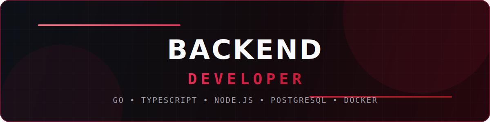

<!--
SETUP:
1. Replace every YOUR_USERNAME with your GitHub username.
2. Replace YOUR_TELEGRAM and YOUR_EMAIL.
3. Replace repository placeholders in the Featured Projects section.
-->

<!-- 

  

 -->

 

<!-- 

  
  
  
  

 -->

  Backend developer focused on reliable APIs, databases, infrastructure and production systems.

 

  

- Building backend services and APIs for university digital products.
- Designing database-backed applications and internal administrative systems.
- Working with containerized deployments, reverse proxies and CI/CD pipelines.
- Improving Go, algorithms, backend architecture and production engineering.

  

  
  
  
  
  

   

  
  
  
  

   

  
  
  
  

  

<table>
<tr>
<td width="50%" valign="top">

### StudForm API

Backend for a Telegram Mini App used to create forms, collect responses and export structured data.

`TypeScript` `Node.js` `REST API` `PostgreSQL` `Docker`

<!-- [Open repository](https://github.com/YOUR_USERNAME/STUDFORM_API_REPOSITORY) -->

</td>
<td width="50%" valign="top">

### Go REST API

Backend service with CRUD operations, middleware, repository layer and structured error handling.

`Go` `REST API` `PostgreSQL` `Docker`

<!-- [Open repository](https://github.com/YOUR_USERNAME/GO_API_REPOSITORY) -->

</td>
</tr>
<tr>
<td width="50%" valign="top">

### University Services Backend

Backend services and internal APIs for student-facing systems and administrative workflows.

`TypeScript` `Node.js` `PostgreSQL` `Docker` `GitLab CI/CD`

<!-- [Open repository](https://github.com/YOUR_USERNAME/UNIVERSITY_BACKEND_REPOSITORY) -->

</td>
<td width="50%" valign="top">

### Go Algorithms

Algorithms, data structures, LeetCode solutions and implementation experiments in Go.

`Go` `Algorithms` `Data Structures`

<!-- [Open repository](https://github.com/YOUR_USERNAME/GO_ALGORITHMS_REPOSITORY) -->

</td>
</tr>
</table>

  

  
  

 

<picture>
  <source
    media="(prefers-color-scheme: dark)"
    srcset="https://raw.githubusercontent.com/YOUR_USERNAME/YOUR_USERNAME/output/github-contribution-grid-snake-dark.svg"
  />
  <source
    media="(prefers-color-scheme: light)"
    srcset="https://raw.githubusercontent.com/YOUR_USERNAME/YOUR_USERNAME/output/github-contribution-grid-snake.svg"
  />
  
</picture>

  

  
  

 

  Design. Build. Deploy.

